# 协议层

ARES 协议层建立在 `AresProtocol` 之上，负责：

- 接收接口层送来的字节或缓冲
- 解析成协议帧
- 调用本地回调或更新同步对象
- 通过接口层回送响应

仓库内当前有两条主要协议线：

- 双向协议
- 绘图协议
- 历史 UART 上下位机协议

此外，代码与日志中仍保留部分 `usb_trans` 命名，它对应的是双向协议的旧使用语境。

## `AresProtocol`

`include/ares/protocol/ares_protocol.h` 定义协议对象：

- `name`
- `api`
- `interface`
- `priv_data`

`AresProtocolAPI` 提供四类入口：

- `handle()`: 处理一整块 `net_buf`
- `handle_byte()`: 处理单字节
- `event()`: 处理连接事件
- `init()`: 协议初始化

是否调用 `handle()` 或 `handle_byte()` 由接口实现决定，不由协议自行调度。

## 生命周期

统一生命周期如下：

1. 由 `ares_bind_interface()` 将协议与接口互绑。
2. 接口先初始化。
3. 协议执行 `init()`。
4. 运行中由接口驱动 `handle()` / `handle_byte()`。
5. USB 等可连接介质会额外触发 `event()`。

维护者扩展协议时，应保证在 `init()` 之后对象已可承受任意 `handle*()` 调用。

## 双向协议

### 角色

双向协议是 ARES 里最接近“控制与同步总线”的协议。它同时支持：

- 同步数据帧
- 远程函数调用
- 错误帧
- 回复帧
- 心跳保活

实现位于：

- 头文件：`include/ares/protocol/dual/dual_protocol.h`
- 实现：`lib/ares/protocol/dual/dual_protocol.c`

### 帧类型

协议定义了四类帧头：

- `SYNC_FRAME_HEAD`
- `FUNC_FRAME_HEAD`
- `ERROR_FRAME_HEAD`
- `REPL_FRAME_HEAD`

其中：

- SYNC 用于镜像一块已注册的数据区。
- FUNC 用于携带三个 `uint32_t` 参数的函数调用。
- REPL 用于返回 `uint32_t` 结果和请求号。
- ERROR 用于差错、重传驱动和心跳。

### 公开接口

- `ares_dual_protocol_init()`
- `ares_dual_protocol_handle()`
- `ares_dual_protocol_handle_byte()`
- `ares_dual_protocol_event()`
- `dual_ret_cb_set()`
- `dual_func_add()`
- `dual_func_remove()`
- `dual_func_call()`
- `dual_sync_add()`
- `dual_sync_flush()`

实例定义通常使用：

- `DUAL_PROPOSE_PROTOCOL_DEFINE(name)`

### 协议私有状态

`struct dual_protocol_data` 维护：

- 心跳定时器
- 错误帧互斥
- 函数表与同步表
- 回复备份队列
- 在线状态和接收时间戳
- 函数返回回调
- 逐字节解析状态机
- CRC 开关

维护上最重要的是：双向协议不是无状态解析器，它显式维护在线态、回放缓存和待同步对象表。

### 注册模型

#### 函数表

`dual_func_add()` 将一个 `id -> callback` 映射加入协议。

约束：

- 最多 `MAX_FUNC_COUNT`
- 回调签名固定为 `uint32_t (*)(uint32_t, uint32_t, uint32_t)`

远端发来 FUNC 帧后，协议会：

1. 查找 `id`。
2. 写入 `arg1`、`arg2`、`arg3`、`req_id`。
3. 执行回调。
4. 组 REPL 帧返回结果。
5. 把结果留存在备份队列中，供错误帧触发重发。

#### 同步表

`dual_sync_add()` 注册一个同步对象：

- `ID`
- 本地数据地址
- 数据长度
- 状态回调

注册成功后会立即尝试 `dual_sync_flush()` 发送当前内容。

同步表适合“有固定 ID、长度已知、需要周期或事件式刷出”的共享数据块。

### 初始化与绑定顺序

推荐顺序：

1. 定义接口实例和双向协议实例。
2. 绑定接口与协议。
3. 再调用 `dual_func_add()` 和 `dual_sync_add()`。
4. 若需要统一处理函数返回，再调用 `dual_ret_cb_set()`。

原因是同步注册会立即尝试发送，而发送路径依赖协议已完成初始化并持有有效接口。

### 运行时行为

#### 解析

协议既支持：

- `handle_byte()` 逐字节状态机
- `handle()` 对整块缓冲逐字节喂入

这让同一协议可以同时跑在 UART 和 USB bulk 上。

SYNC 帧长度不能仅靠帧头得知，必须在收到 ID 后查同步表长度。因此：

- 未注册的 SYNC ID 无法被正确解析。
- 同步表就是协议长度判定的一部分。

#### 在线状态与心跳

初始化时会启动周期性心跳定时器。运行中：

- 周期发送心跳性质的 ERROR 帧。
- 依据 `last_receive` 与 `last_heart_beat` 判断上线或掉线。
- 连接事件也会直接设置 `online`。

掉线时会清空函数回复备份队列。

#### 发送路径

双向协议的发送始终通过已绑定接口：

- 优先使用 `alloc_buf_with_data()` 包装现成帧
- 否则分配 `net_buf` 后复制数据
- 若接口支持 `send_with_lock()`，则利用互斥保护在飞帧

这解释了为什么 USB 实现提供了 `send_with_lock()`，而 UART 没有。

### CRC

双向协议支持可选 CRC16-CCITT。是否启用由 `dual_protocol_data.crc_enabled` 决定。
启用后：

- 发送帧会追加 2 字节 CRC
- 完整帧处理前会先校验 CRC

是否以及何时打开该标志，当前不是统一公开 API，而是协议私有配置。
维护者修改实例宏或调用点时应确保两端一致。

### 错误边界

双向协议的主要错误边界：

- 协议离线时，`dual_func_call()` 和 `dual_sync_flush()` 返回 `-EUNATCH`
- 同步表或函数表满时，新增注册失败
- 未知 SYNC ID 无法确定长度，也无法完成解析
- 发送忙时，`dual_sync_flush()` / `dual_func_call()` 可能返回忙错误
- CRC 校验失败时，完整帧直接丢弃
- 未注册 FUNC ID 会被记录错误，不执行业务回调

维护者处理现场问题时，应先区分“帧解析失败”与“解析成功但业务 ID 未注册”。

### 最小入口

```c
DUAL_PROPOSE_PROTOCOL_DEFINE(link_proto);
ARES_UART_INTERFACE_DEFINE(link_if);

ares_uart_init_dev(&link_if, uart_dev);
ares_bind_interface(&link_if, &link_proto);

dual_func_add(&link_proto, 0x10, my_rpc);
dual_sync_add(&link_proto, 0x20, sync_buf, sizeof(sync_buf), sync_cb);
```

## 绘图协议

### 角色

绘图协议面向上位机变量监控和在线改值，协议本身独立于具体接口，
但仓库中提供了一个基于 UART 的自动绑定入口。

实现位于：

- 头文件：`include/ares/protocol/plotter/aresplot_protocol.h`
- 实现：`lib/ares/protocol/plotter/aresplot_protocol.c`

### 功能范围

协议支持三类主机命令：

- `ARESPLOT_CMD_START_MONITOR`
- `ARESPLOT_CMD_SET_VARIABLE`
- `ARESPLOT_CMD_SET_SAMPLE_RATE`

设备侧主要回送：

- `ARESPLOT_CMD_MONITOR_DATA`
- `ARESPLOT_CMD_ACK`
- `ARESPLOT_CMD_ERROR_REPORT`（可选）

### 数据模型

绘图协议维护一个可监视变量表，每项包含：

- 变量地址
- 原始类型
- 可选名称

上位机下发监控配置后，定时器按采样周期把这些变量统一转换为 `float32` 输出。

### 公开接口

- `ares_plotter_protocol_init()`
- `ares_plotter_protocol_handle()`
- `ares_plotter_protocol_handle_byte()`
- `ares_plotter_protocol_event()`
- `plotter_add_variable()`
- `plotter_remove_variable()`
- `plotter_set_sample_rate()`
- `aresplot_report_error()`（可选）

实例定义使用：

- `PLOTTER_PROTOCOL_DEFINE(name)`

### 帧格式

绘图协议使用固定包围符：

- SOP: `0xA5`
- EOP: `0x5A`

中间字段按以下顺序排列：

1. `CMD`
2. `LEN` 小端
3. `PAYLOAD`
4. `CHECKSUM`

校验是对 `CMD`、`LEN` 和 `PAYLOAD` 的逐字节异或。

### 初始化与自动绑定

协议可以手工绑定到任意兼容接口，但仓库内还有一个条件编译自动入口：

- `CONFIG_PLOTTER`

打开后，`aresplot_auto_init()` 会在 `APPLICATION` 阶段：

1. 取 `DT_ALIAS(plot)` 对应 UART 设备。
2. 创建私有 UART 接口和绘图协议实例。
3. 调用 `ares_uart_init_dev()`。
4. 调用 `ares_bind_interface()`。

这条路径适合专用调试串口，不适合一个端口承载多协议复用。

### 运行时行为

#### 监视启动

`CMD_START_MONITOR` 会清空旧监视表并按主机给出的地址和类型重建。
若 `num_vars_requested == 0`，监控被停止。

#### 在线改值

`CMD_SET_VARIABLE` 允许直接按地址写入标量值。写入前仅依据协议声明的类型解释 payload，
不做地址白名单、范围验证或对象生命周期校验。

这意味着：

- 该协议默认面向受信任调试环境。
- 把它暴露给不受控主机前必须先加访问约束。

#### 采样

监控数据由定时器驱动发送。每帧负载包含：

- 当前毫秒时间戳
- 每个变量的 `float32` 值

所有类型最终都被投影为 `float32`，包括整型和布尔。

### 配置项

`lib/ares/protocol/plotter/Kconfig` 提供：

- `CONFIG_ARES_PLOTTER_PROTOCOL`
- `CONFIG_PLOTTER`
- `CONFIG_ARESPLOT_MAX_VARS_TO_MONITOR`
- `CONFIG_ARESPLOT_SHARED_BUFFER_SIZE`
- `CONFIG_ARESPLOT_ENABLE_ERROR_REPORT`
- `CONFIG_ARESPLOT_FREQ`

此外头文件还定义了：

- `ARESPLOT_DEFAULT_SAMPLE_PERIOD_MS`

### 错误边界

绘图协议的典型边界：

- payload 长度错误：返回 ACK 错误码
- 变量数超出上限：返回资源限制错误
- 校验和错误：返回 ACK 校验错误
- 帧过大：组帧失败
- `CMD_SET_VARIABLE` 写入的是裸地址，错误地址会直接越界到系统内存

最后这一点是维护上最重要的安全前提。

### 最小入口

```c
PLOTTER_PROTOCOL_DEFINE(plot_proto);
ARES_UART_INTERFACE_DEFINE(plot_if);

ares_uart_init_dev(&plot_if, uart_dev);
ares_bind_interface(&plot_if, &plot_proto);
```

若使用自动模式，只需配置 `CONFIG_PLOTTER=y` 并提供 `plot` UART alias。

## 历史 UART 上下位机协议

本节合并早期 interlink 文档中的 UART 上下位机协议。它记录的是旧链路的线格式，
不代表当前 `AresProtocol` 抽象中新增了一套独立实现。

### 执行、数据与错误帧

#### 执行发送帧

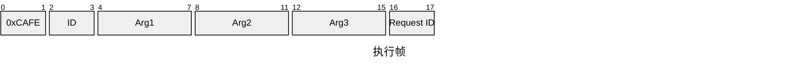

#### 执行返回帧

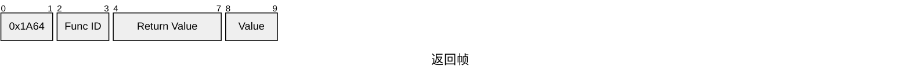

#### 数据帧

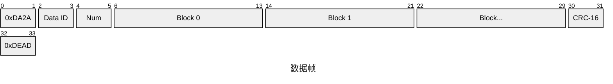


一帧数据中最多包含 12 个数据块。

#### 错误帧

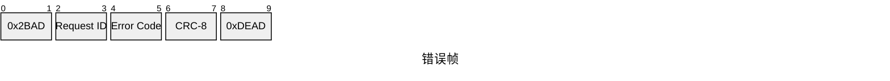

错误码：

```text
0xFAC2  CRC 校验错误
0xF411  未知帧头
0x8848  未知帧尾
0x6666  未知变量码
0x2024  未知函数码
0x1024  参数数量错误
0xCAFE  发送超时
0x22DD  下位机忙
0x2401  下位机/上位机收到对方错误码，数据已经丢弃且无法重发
0xBEEF  重要事件，需要对方立刻处理下一帧数据
0x90DE  下位机重启
```

错误帧中的 `Request ID` 可以是执行帧的 `Request ID`，也可以是数据帧的 `Data ID`。
上位机最好保存尽可能多的数据，下位机会至少保留 `256 Bytes`。重发次数超过 3 次后，
上位机应停止发送数据并等待下位机重启。

### 注册与控制流程

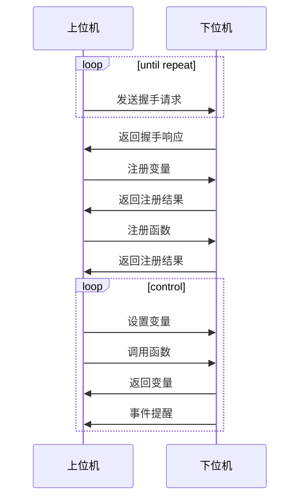

基础应答码：

```text
0x06  ACK，收到通知且校验正确
0x15  NAK，消息无法解析
0x18  CAN，收到通知但校验错误
```

#### 变量注册

变量注册由上位机发送变量名并决定标识符。注册帧头为 `0x2F20`，结尾为 `0x202F`。
一帧最多包含 16 个变量，超过 16 个变量时分多帧发送。

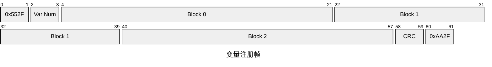

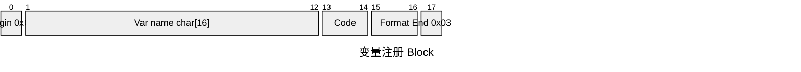

`var_code` 由上位机决定，之后请求或设置该变量时用该 code 指代。

```text
FP32  0x0
IN32  0x1
```

CRC-16 校验位位于 `0x202F` 前 2 字节。

#### 函数注册

函数注册由上位机发送函数名并决定标识符。注册帧头为 `0x3F20`，结尾为 `0x203F`。
一帧最多包含 16 个函数，超过 16 个函数时分多帧发送。


`func_code` 由上位机决定，之后调用该函数时用该 code 指代。

#### 事件注册

事件注册由上位机发送事件名并决定标识符。注册帧头为 `0x4F20`，结尾为 `0x204F`。
一帧最多包含 8 个事件，超过 8 个事件时分多帧发送。

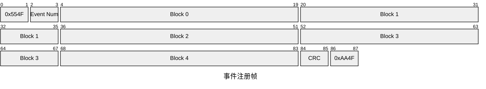

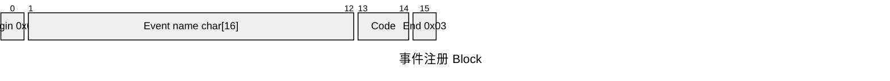

`event_code` 由上位机决定，之后事件通知使用该 code 指代。

#### 设置变量

一帧最多设置 8 个变量，超过 8 个变量时分多帧发送。

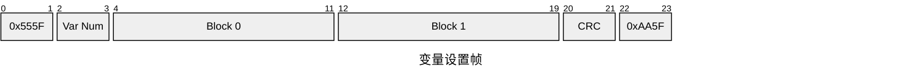


CRC-16 覆盖第 4 字节到倒数第 4 字节之间的数据。

#### 请求变量

一帧最多请求 8 个变量，超过 8 个变量时分多帧发送。

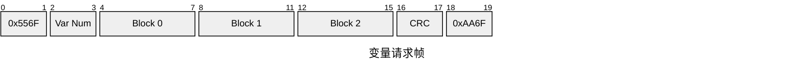

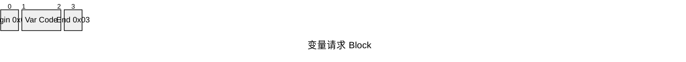

变量回复一帧最多包含 4 个变量，超过 4 个变量时分多帧发送。

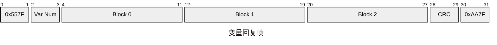

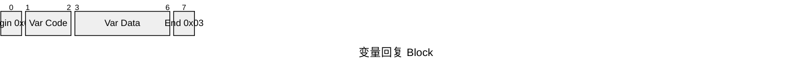

#### 调用函数

函数调用帧最多包含 2 个函数。超过 2 个函数时分多帧发送，执行顺序与帧内顺序一致。

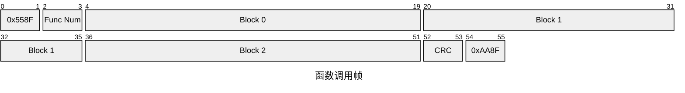

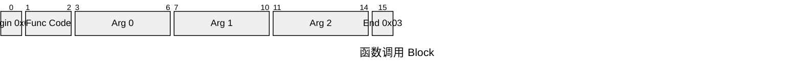

#### 事件通知

事件通知帧只能包含 1 个事件。

```mermaid
packet-beta
title 事件通知帧
0-1: "0x559F"
2-3: "Event Code"
4-35: "Arg 0"
36-67: "Arg 1"
68-69: "CRC"
70-71: "0xAA9F"
```

## 历史 `usb_trans` 命名

代码和日志中仍有 `usb_trans_heart_beat()`、`usb_offline_clean()` 一类命名。
这里的 `usb_trans` 不是单独保留的一套公共头文件协议，而是双向协议早期以 USB 为主链路时
留下的命名痕迹。

维护上应这样理解：

- 它的当前语义属于双向协议。
- 它并不要求底层必须是 USB。
- UART 与 USB bulk 都可以驱动该协议。

若未来做命名清理，应把这类名称统一收敛到双向协议语义，而不是再抽出一层新协议。
