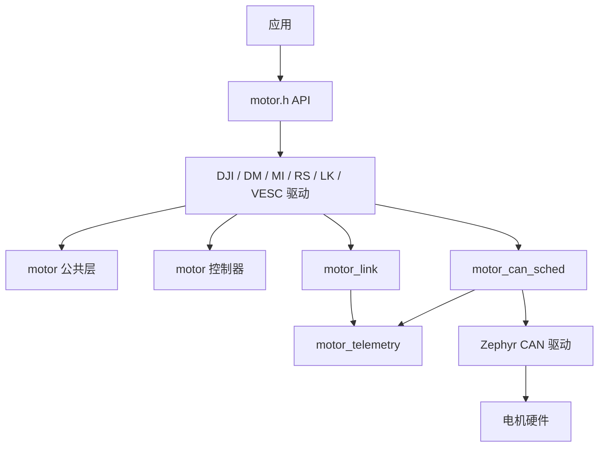

# 电机子系统架构

motor 子系统提供统一的执行器模型，并将电机厂商协议、控制器选择、CAN 发送调度、在线状态和遥测拆分到清晰的层次中。

## 层次

应用只依赖 `include/zephyr/drivers/motor.h`。厂商驱动负责把统一 setpoint 转换为协议帧，并把反馈帧转换为统一 status。

## 应用接口

motor 的应用接口由三类调用组成：

| 接口 | 用途 |
| --- | --- |
| `motor_set()` | 原子下发目标。模式、目标量和控制器选择一并提交。 |
| `motor_get()` | 读取当前状态快照。 |
| `motor_control()` | 执行使能、失能、清零、清控制器、清故障等命令。 |

便捷宏：

| 宏 | 展开语义 |
| --- | --- |
| `motor_set_angle(dev, angle)` | `PV + MOTOR_TARGET_POSITION` |
| `motor_set_rpm(dev, rpm)` | `VO + MOTOR_TARGET_SPEED` |
| `motor_set_speed(dev, speed)` | `VO + MOTOR_TARGET_SPEED` |
| `motor_set_torque(dev, torque)` | `VO + MOTOR_TARGET_TORQUE` |
| `motor_set_mit(dev, speed, angle, torque)` | `MIT + MOTOR_TARGET_POSITION` |

便捷宏适合简单应用。需要限制、前馈或显式选择控制器时，应直接构造 `motor_setpoint_t`。

## 目标设定

`motor_setpoint_t` 表示一次目标提交：

| 字段 | 说明 |
| --- | --- |
| `angle` | 位置目标。单位由驱动文档约定，当前统一以角度表示。 |
| `rpm` | 速度目标。 |
| `torque` | 扭矩目标或扭矩前馈。 |
| `speed_limit[2]` | 速度限制，`[min, max]`。仅在控制器和驱动支持时生效。 |
| `torque_limit[2]` | 扭矩限制，`[min, max]`。 |
| `mode` | `MIT`、`PV` 或 `VO`。 |
| `target` | `TORQUE`、`SPEED` 或 `POSITION`。 |
| `controller_select` | 默认匹配或按 ID 选择。 |
| `controller_id` | 显式控制器 ID，或由默认匹配填入。 |

`motor_set()` 不是流控接口。驱动可以缓存目标，并按自身协议周期发送。应用不应假定每次 `motor_set()` 都立即对应一帧 CAN。

## 状态快照

`motor_status_t` 是驱动状态快照：

| 字段 | 说明 |
| --- | --- |
| `angle` | 当前角度。 |
| `rpm` | 当前转速。 |
| `torque` | 当前扭矩或估算扭矩。 |
| `temperature` | 温度。驱动不支持时为默认值。 |
| `sum_angle` | 多圈累计角度。 |
| `speed_limit` | 当前速度限制。 |
| `torque_limit` | 当前扭矩限制。 |
| `mode` | 最近一次接受的控制模式。 |
| `target` | 最近一次接受的目标类型。 |
| `controller_id` | 当前控制器。 |
| `online` | 链路在线状态。 |
| `enabled` | 电机侧或驱动侧使能状态。 |
| `error` | 驱动映射后的错误码。 |

`enabled` 表示电机反馈或驱动状态，不等同于用户是否请求使能。用户请求状态保存在 `motor_link_state.requested_enabled` 中，由驱动内部使用。

## 控制器模型

控制器通过 devicetree 的 `controllers` 属性挂到电机节点。每个控制器声明：

- 适用的 `mode`。
- 适用的 `target`。
- 输出类型。
- 所需状态量。
- 参数组。

内置控制器支持：

| compatible | 模式 | 目标 | 输出 |
| --- | --- | --- | --- |
| `motor-controller,mit` | `MIT` | `POSITION` | 原生参数。 |
| `motor-controller,pv` | `PV` | `POSITION` | 扭矩，附带中间速度。 |
| `motor-controller,vo` | `VO` | `SPEED` 或 `TORQUE` | 扭矩。 |

`motor_resolve_controller()` 按 `(mode, target)` 匹配默认控制器；显式选择时校验 `controller_id` 对应的控制器是否匹配目标。

## 链路状态

`motor_link_state` 记录两件事：

- 电机是否在线。
- 用户是否请求电机保持使能。

驱动通过以下模式维护在线状态：

| 电机类型 | 链路模型 |
| --- | --- |
| DJI | 电机周期上报。收到上报即在线，连续缺失上报后离线。 |
| DM、MI、RS、LK | 主控发送请求或控制帧，电机回复。连续缺失回复后离线。 |
| VESC | 状态帧和 PING/PONG 均可刷新在线状态。 |

`motor_link` 只处理状态迁移，不处理协议帧、不发送日志、不决定控制目标。

## CAN 调度器

`motor_can_sched` 为 motor 驱动提供统一 CAN 发送入口。它管理多个 CAN 总线、优先级队列、周期帧、请求回复帧和发送统计。

优先级：

| 优先级 | 用途 |
| --- | --- |
| `CRITICAL` | 对实时性强且不能被普通请求压住的帧使用。 |
| `HIGH` | 使能、失能、清故障、请求回复等重要控制帧。 |
| `NORMAL` | 周期控制帧和普通目标更新。 |
| `LOW` | 可延迟的后台帧。 |

常用接口：

| 接口 | 用途 |
| --- | --- |
| `motor_can_sched_register_can()` | 注册 CAN 设备。 |
| `motor_can_sched_send_prio()` | 发送普通帧，可选高优先级。 |
| `motor_can_sched_send_with_priority()` | 以明确优先级发送单帧。 |
| `motor_can_sched_send_reply()` | 发送会触发回复的帧，并跟踪回复超时。 |
| `motor_can_sched_send()` | 通用入口，支持周期帧和回复跟踪。 |
| `motor_can_sched_update()` | 更新周期帧内容。 |
| `motor_can_sched_remove()` | 删除周期帧。 |
| `motor_can_sched_report_rx()` | 驱动在收到 CAN 帧时回报调度器。 |
| `motor_can_sched_get_stats()` | 读取发送、丢包、重试和延迟统计。 |

驱动收到 CAN 帧后应调用 `motor_can_sched_report_rx()`。该调用为调度器提供 RX 负载、回复匹配和窗口统计，不替代驱动自己的协议解析。

## 遥测

`motor_telemetry` 统一输出 motor 在线状态和 CAN 调度器压力信息。

默认日志策略：

- 电机在线状态发生变化时输出 online/offline。
- CAN 调度器只有在 `tx_busy`、drop、ack timeout、pending full 或 giveup 增加时输出告警。
- `CONFIG_MOTOR_LOG_LEVEL >= 4` 时输出调试级 TX latency 统计。

遥测层不负责判断电机是否离线。离线判定由各驱动和 `motor_link` 完成。

## 驱动说明

### DJI

DJI 驱动按同一 CAN TX ID 聚合四个电机的控制量。反馈由电机周期上报，驱动根据 RX ID 映射到对应设备。`PV` 位置控制会经过控制器计算中间速度和目标扭矩；速度和扭矩模式保留应用下发的速度目标。

### DM

DM 驱动以主控控制帧触发电机回复。默认控制请求频率由 `CONFIG_MOTOR_DM_DEFAULT_FREQ_HZ` 控制。`read_only` 节点只接收反馈，不自动使能或发送控制帧。

### MI

MI 驱动使用扩展 CAN ID 中的通信类型区分使能、停止、MIT 控制和反馈。驱动提供统一 `motor_set()`/`motor_get()`，协议参数封装在驱动内部。

### RS

RS 驱动与 MI 类似，支持 Robstride 系列型号参数。`auto_report` 用于描述电机是否主动上报。

### LK

LK 驱动支持扭矩、速度和多圈位置命令，并可更新电机内部控制参数。参数更新和控制帧由独立 work handler 处理。

### VESC

VESC 驱动使用扩展 CAN ID。控制目标缓存为最新值，并按 `CONFIG_MOTOR_VESC_CONTROL_FREQ_HZ` 周期发送。在线状态由状态帧和 PONG 回复共同维护；`rx_id` 表示本主机在 VESC PING/PONG 中使用的 host ID。

### Yinshi LA

Yinshi LA 是线性执行器驱动，公共 API 位于 `include/zephyr/drivers/linear_actuator.h`。它不实现旋转电机 API。

## 错误处理

驱动返回负 errno 表示调用失败。常见错误包括：

| 错误 | 含义 |
| --- | --- |
| `-ENOSYS` | 驱动没有实现该回调。 |
| `-ENOTSUP` | 当前模式、目标或控制器不支持。 |
| `-EINVAL` | 参数无效或控制器不匹配。 |
| `-ENOSPC` | 调度队列、表项或 filter 资源不足。 |
| `-ETIMEDOUT` | 等待回复超时。 |
| `-EIO` | 协议或底层通信失败。 |

`motor_stats_get()` 可读取运行期计数器，用于长期运行时观察配置错误、未知帧、发送失败和不支持的命令。
