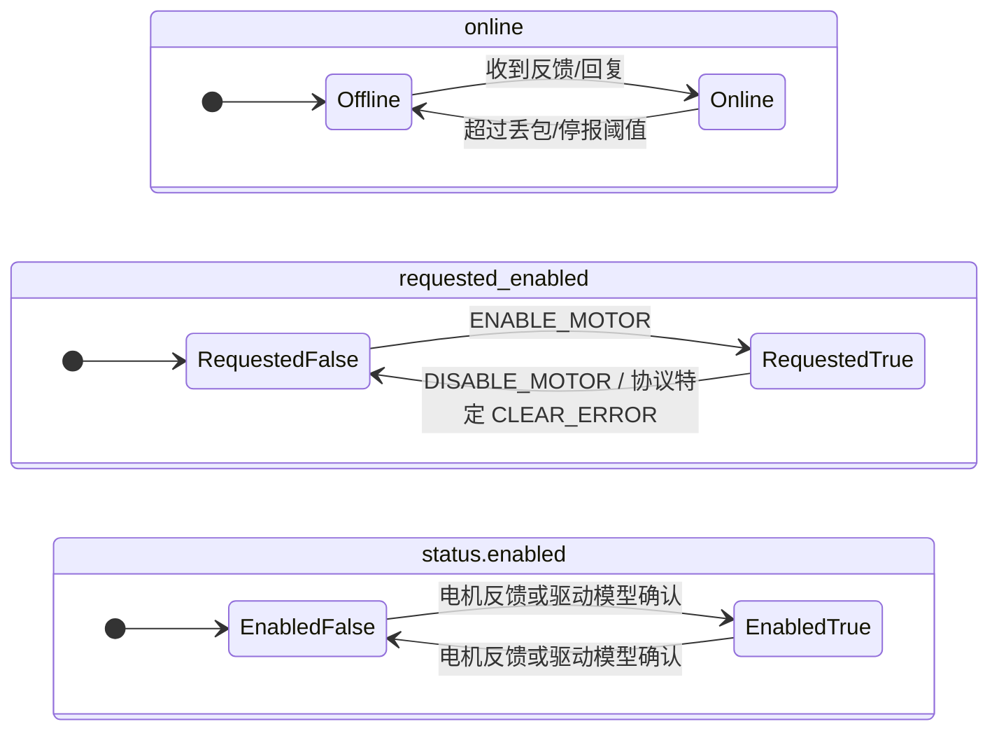

# 电机链路与遥测

`motor_link` 和 `motor_telemetry` 共同负责 motor 子系统的可观测性，但两者职责不同：

- `motor_link` 管状态迁移。
- `motor_telemetry` 管状态输出。

维护时需要先分清楚“谁决定状态变化”，再决定应该改哪一层。

## 链路状态

每个 motor 驱动都持有一个 `motor_link_state`：

- `online`
  当前是否认为链路在线。
- `requested_enabled`
  应用是否请求电机保持使能。
- `missed`
  连续丢失的回复或周期上报计数。

这里最重要的约束是：`requested_enabled` 不等于 `enabled`。

- `requested_enabled` 是主控侧意图。
- `status.enabled` 是驱动对当前使能状态的暴露，可能来自电机反馈，也可能来自驱动行为模型。
- `online` 是链路可达性，只能由收到反馈、回复或状态帧来证明。

例如：

- DM 额外维护电机反馈中的使能位。
- DJI、MI、RS 的 `status.enabled` 暴露当前驱动模型中的使能意图，即 `requested_enabled`。

三者的状态机如下：

## 状态迁移接口

`motor_link` 提供的接口非常窄：

- `motor_link_request_enable()`
- `motor_link_request_disable()`
- `motor_link_observe_reply()`
- `motor_link_note_missed_reply()`
- `motor_link_observe_periodic_report()`
- `motor_link_note_periodic_timeout()`
- `motor_link_mark_online()`
- `motor_link_mark_offline()`

这些函数只更新状态并在边沿变化时触发遥测。它们不做以下事情：

- 不发 CAN 帧。
- 不写日志以外的副作用。
- 不推导控制目标。
- 不解析协议字段。

## 在线模型

子系统目前存在两类在线判定。

### 请求-回复型

DM、MI、RS 以及部分 LK 路径由主控发请求，再等待反馈或回复：

1. 应用使能电机，驱动调用 `motor_link_request_enable()`。
1. 驱动周期发送控制或探测帧。
1. 收到回复时调用 `motor_link_observe_reply()`。
1. 连续多次未收到回复时调用 `motor_link_note_missed_reply()`。
1. 达到阈值后转离线。

这类模型的离线阈值通常与控制发送周期绑定。阈值过小会导致总线抖动时频繁翻转，阈值过大又会拖慢故障发现。

### 周期上报型

DJI 依赖电机自主上报反馈：

1. 收到周期状态帧时调用 `motor_link_observe_periodic_report()`。
1. 由后台检查路径或发送路径监视上报间隔。
1. 超过阈值时调用 `motor_link_note_periodic_timeout()`。

在这种模型里，控制帧是否已发送不决定在线状态，状态帧本身才决定在线。

### 混合型

VESC 同时使用状态帧和 `PING/PONG`：

- 状态帧能刷新最近接收时间。
- `PONG` 用于主动探测链路。
- 超时则由监视任务直接调用 `motor_link_mark_offline()`。

这类驱动的关键不是“漏了几次回复”，而是“最近一次可证明链路存活的接收时间”。

## 遥测原因码

遥测只输出少量归因，当前包括：

- `REPLY`
- `MISSED_REPLY`
- `PERIODIC_REPORT`
- `PERIODIC_TIMEOUT`
- `RX_TIMEOUT`

原因码的作用是帮助定位状态变化来自哪条路径，而不是替代完整跟踪。新增原因码前，先确认现有原因是否已经足够区分问题来源。

## 日志策略

`motor_telemetry` 默认遵循边沿日志策略：

- 电机从离线到在线，只记一条 online 日志。
- 电机从在线到离线，只记一条 offline 日志，并带丢失计数或超时原因。
- CAN 调度器只在健康指标恶化时输出告警。

这样做的目的是避免高频协议把日志淹没。维护者如果需要逐帧分析，应当增加临时调试，而不是把遥测长期改成流式日志。

## 离线恢复

在线恢复应依靠真实接收事件，而不是“我刚刚发过一帧控制”：

- 请求-回复型驱动只有在收到反馈后才应重新置 online。
- 周期上报型驱动只有在重新收到状态帧后才应恢复。
- VESC 只有在状态帧或 `PONG` 到达时才应恢复。

`tests/native_sim/motor_driver_sim` 对这条约束有专门覆盖，尤其检查离线后恢复时间窗口和控制发送的继续性。

## 常见维护错误

### 把 `request_disable` 当成离线

`motor_link_request_disable()` 会清除 `requested_enabled` 并复位计数，但“用户不想让它动了”不等于“链路坏了”。如果后续仍有周期状态上报，驱动是否继续把它视为 online，要按该协议的设计决定。

### 在 RX 回调里直接刷大量日志

RX 回调应该尽量短，只做：

- `motor_can_sched_report_rx()`
- 协议解包
- `motor_link_*` 状态更新
- 必要的 work 提交

高频日志应留给 debug build。

### 让遥测决定状态

`motor_telemetry` 只消费事件，不应反过来改变链路状态。若维护中发现遥测代码参与状态判断，通常是边界已经被打破。

## 调整在线阈值时的检查项

改动离线阈值、监视周期或恢复逻辑时，至少确认：

- 请求-回复型驱动在正常发送频率下不会误报离线。
- 周期上报型驱动在拔线或停报后能及时转离线。
- `status.online` 翻转不会导致控制器错误重置。
- 日志数量仍可控，不因抖动而爆炸。

链路层的目标是稳定、保守、可解释。宁可少做协议推断，也不要把状态机做得过于聪明。
